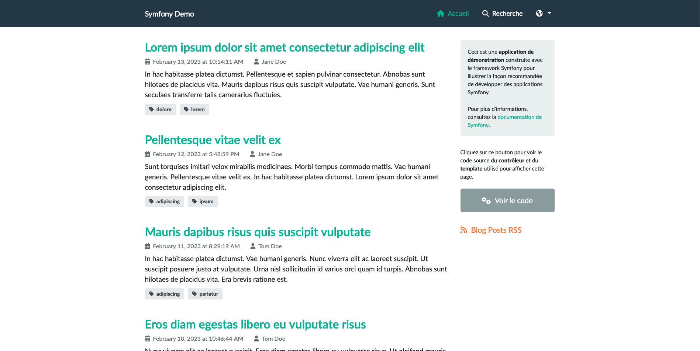
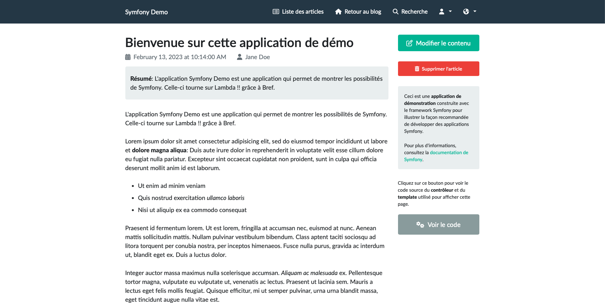

# PHP on AWS Lambda with Bref framework, deployed with Terraform

This repository shows how to
* instrument a Symfony Demo Application 
with Bref framework, that provides a Lambda runtime for PHP.
* deploy the application with Terraform.


## Deploying
After logging on AWS with your CLI, just run 
```
terraform apply
```
 
The data.sql file contains the necessary data to seed the Aurora database. 
You can deploy it with a bastion. 

## Result

